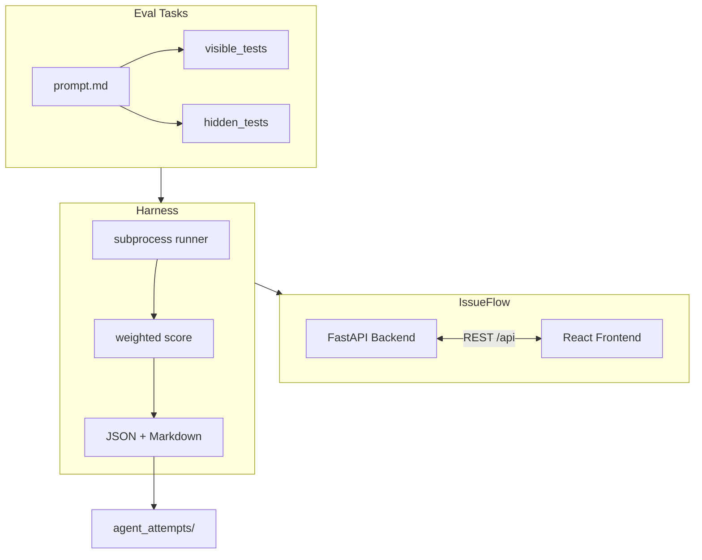

# Agent Eval Harness

Built as a demo project for [Mechanize](https://www.mechanize.work/) because I really love what y’all are building!

Video walkthrough - https://drive.google.com/file/d/1-F0wYpD4FWDL8EN0cr9qWbgJJ2FHz13i/view?usp=sharing

I wanted to make something that gets close to the kind of work your team seems to care about. Not just building another AI app, but designing a real software environment where coding agents can be tested, graded, and understood.

This project is a small eval harness built around **IssueFlow**, a full-stack issue tracker with a FastAPI + SQLite backend and a React frontend. IssueFlow acts as the real codebase an agent would edit. The tasks are normal software engineering tasks: backend state transitions, SLA logic, frontend cache behavior, and webhook normalization. They are meant to feel like real engineering problems instead of isolated puzzle files.

The main thing I wanted to explore is the gap between “the agent passed the visible tests” and “the agent actually solved the engineering problem.” A patch can pass the shallow checks while still missing deeper invariants like state-machine rules, time boundaries, React Query cache consistency, or idempotency. This repo tries to make that gap visible through task prompts, visible tests, hidden-style tests, deterministic grading, JSON/Markdown reports, and failure analysis.

## What this demonstrates

- **Real target codebase:** FastAPI + SQLite backend and React + React Query frontend
- **Four scoped eval tasks:** backend state transitions, SLA logic, React Query cache consistency, webhook normalization
- **Visible vs hidden-style tests** to expose overfitting to happy-path checks
- **Deterministic pytest/Vitest grading harness** with weighted scoring and structured failure tags
- **Inspectable grading output:** per-task JSON/Markdown reports with scores, stdout/stderr excerpts, and failure-mode tags
- **Failure analysis** in `agent_attempts/` (weak vs strong patterns per task)

## Verified golden reference

| Check | Result |
|-------|--------|
| Backend tests | **76** passing (`apps/issueflow-backend/tests`) |
| Frontend unit tests | **6** passing (`apps/issueflow-frontend`, Vitest) |
| Eval tasks | **4 / 4** passing (visible + hidden-style suites) |
| Golden reference score | **1.00** average |
| Reports | [`evals/results/aggregate_summary.json`](evals/results/aggregate_summary.json), [`.md`](evals/results/aggregate_summary.md) |

Run timestamp in the checked-in report: `2026-05-31T22:53:24Z`. Reproduce with `python scripts/run_all_evals.py --output-dir=evals/results` after setup.

## Why this is relevant to coding-agent evals

Hard SWE evaluations need more than a single pass/fail bit. They need a **target environment** (a real codebase), a **task prompt**, a **deterministic grader**, and enough structure to explain **why** a patch failed.

Agents often **overfit visible tests**: they patch routes or one component so basic wiring passes, while lifecycle rules, time boundaries, cache coherence, or idempotency stay broken. This repo encodes that pattern on purpose. Each task ships a small **visible** suite and a deeper **hidden-style** suite. The harness runs both, applies weights from `task.yaml`, and writes inspectable reports. The grader does not rely on an LLM judge.

Hidden-style tests are **included in this repository for transparency**. In a production eval system, those suites would usually be withheld from the agent. Here they document grader intent and make the benchmark reproducible for reviewers.

## Four eval tasks

| Task | Capability tested | Hidden-style checks (examples) |
|------|-------------------|--------------------------------|
| `task_001_backend_state_transition` | Lifecycle invariants and audit behavior | Blocked/reopen paths, `resolved_at` clearing, closed-issue PATCH guards, audit idempotency |
| `task_002_sla_feature` | Deterministic SLA from priority and age | Exact overdue boundaries, 80% `at_risk` band, timezone normalization, terminal status short-circuit |
| `task_003_frontend_stale_state` | React Query cache after mutations | List/detail alignment, filter views after status change, no full-page reload, rapid sequential updates |
| `task_004_webhook_normalization` | Messy payloads and idempotency | Ambiguous priority rejection, assignee validation, flexible dates, ingest logging, no duplicate audit on retry |

Each task folder includes `prompt.md`, `task.yaml`, `visible_tests/`, `hidden_tests/`, and `expected_failures.md`.

## Three layers

| Layer | Location | Role |
|-------|----------|------|
| **1. Target codebase** | `apps/issueflow-backend/`, `apps/issueflow-frontend/` | IssueFlow: the app an agent edits |
| **2. Eval tasks** | `evals/tasks/` | Prompts, tests, grader config |
| **3. Harness + analysis** | `evals/harness/`, `evals/results/`, `agent_attempts/` | Run tests, score, report, review failure patterns |



## How to run

**Path note (Windows):** Use a directory **without apostrophes**, for example `C:\dev\agent-eval-harness`. Some Vite/Vitest tooling fails when the repo path contains `'` characters.

### Setup

**Windows (PowerShell):**

```powershell
cd C:\dev\agent-eval-harness (Put your path here)
.\scripts\setup.ps1
.\.venv\Scripts\Activate.ps1
```

**macOS / Linux:**

```bash
cd agent-eval-harness
./scripts/setup.sh
source .venv/bin/activate
```

### Run the app

**Backend (terminal 1):**

```powershell
uvicorn app.main:app --reload --app-dir apps/issueflow-backend
```

**Frontend (terminal 2):**

```powershell
cd apps/issueflow-frontend
npm run dev
```

Open http://localhost:5173 (Vite proxies `/api` to the backend). API docs: http://127.0.0.1:8000/docs

### Run tests

**Backend (76 tests):**

```powershell
python -m pytest apps/issueflow-backend/tests -q
```

**Frontend unit tests (6 tests) and build:**

```powershell
cd apps/issueflow-frontend
npm test
npm run build
```

Playwright e2e (`npm run e2e`) is available but **not part of the verified golden-reference baseline** documented above.

### Run evals

**One task:**

```powershell
python -m evals.harness.run_task --task evals/tasks/task_001_backend_state_transition --output-dir=evals/results
```

Replace the task folder for tasks 002 through 004.

**All tasks:**

```powershell
python scripts/run_all_evals.py --output-dir=evals/results
```

On PowerShell, prefer `--output-dir=evals/results` (equals form).

**Optional (Make, Unix or Windows with make):**

```bash
make test-backend
make eval TASK=task_001_backend_state_transition
make eval-all
```

## Sample golden output

From [`evals/results/aggregate_summary.json`](evals/results/aggregate_summary.json):

| Metric | Value |
|--------|-------|
| Tasks run | 4 |
| Average overall score | **1.00** |
| Failed tasks | none |
| Total runtime | ~19s |

| Task | Score | Visible | Hidden |
|------|-------|---------|--------|
| `task_001_backend_state_transition` | 1.00 | pass | pass |
| `task_002_sla_feature` | 1.00 | pass | pass |
| `task_003_frontend_stale_state` | 1.00 | pass | pass |
| `task_004_webhook_normalization` | 1.00 | pass | pass |

## Failure analysis

[`agent_attempts/`](agent_attempts/) includes weak-vs-strong attempt notes per task. They illustrate how visible-test overfitting shows up in practice (for example route-layer hacks that pass visible suites but fail hidden-style invariants).

See [`agent_attempts/README.md`](agent_attempts/README.md) and [`FAILURE_ANALYSIS.md`](FAILURE_ANALYSIS.md) for methodology.

## Limitations and future work

- No automated agent runner yet (apply patch, then run harness manually or via a future script)
- No git worktree sandboxing for isolated agent attempts
- Hidden-style tests are in-repo for transparency; production evals would typically keep them private
- No CI workflow in this repository yet
- No Docker isolation (local venv + `npm install` today)
- Scoring is test-pass-based with heuristics; no linter integration in the `code_quality` category yet

## Further reading

- [ARCHITECTURE.md](ARCHITECTURE.md) — system design for app and harness
- [EVAL_DESIGN.md](EVAL_DESIGN.md) — per-task design and scoring
- [FAILURE_ANALYSIS.md](FAILURE_ANALYSIS.md) — reading failures and reports
- [agent_attempts/README.md](agent_attempts/README.md) — attempt notes per task
- [apps/issueflow-backend/SETUP.md](apps/issueflow-backend/SETUP.md) — backend details
- [apps/issueflow-frontend/SETUP.md](apps/issueflow-frontend/SETUP.md) — frontend details
